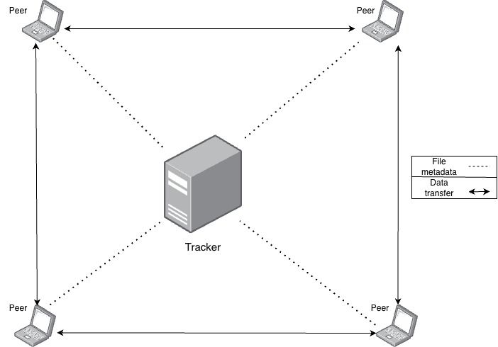

# p2p-share

This project implements a hybrid P2P network where a central tracker stores file metadata, while peers independently manage the actual file transfers.

Peers can register files they are sharing, download specific file chunks from other peers, and use the central tracker for peer discovery and file metadata coordination.

Peer info and file metadata are stored in Redis DB.



## Building the server

The server is built and run inside a Docker container for ease of use and portability.

```
docker build -t p2p .
```

## Starting the application

Start Redis DB (could be hosted on Docker or on bare-metal).
Currently using Docker for illustration.

```
docker run --name my-redis-container -p 6379:6379 -d redis
```

We can start the server now.<br>
Please provide the IP address through which Redis is accessible in the below command.
```
docker run p2p <ip> 6379
```

## Client application

The client shares file metadata with the server and directly communicates with other peers to send and receive files.

Starting the client:
```
python3 client.py --server_ip <server_ip> --server_port <server_port> --client_ip <client_ip> --client_port <client_port>
```

A simple command line interface is provided to interact with the client application.
Multiple clients can be started on different client ports to simulate the hybrid P2P network.